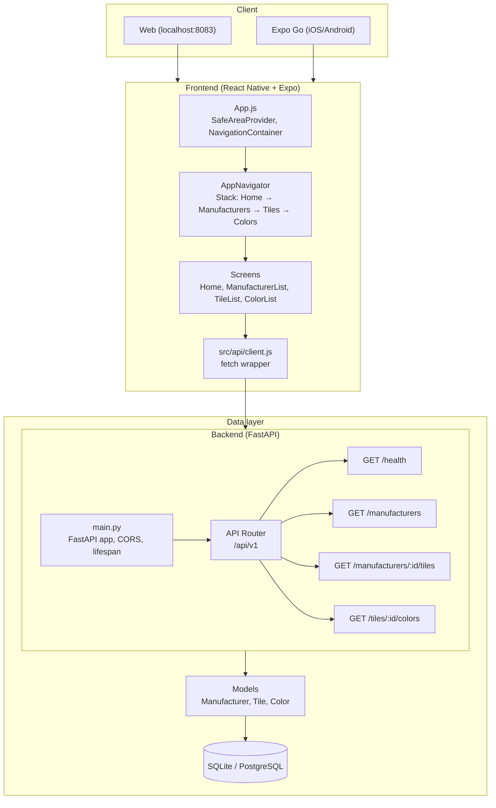
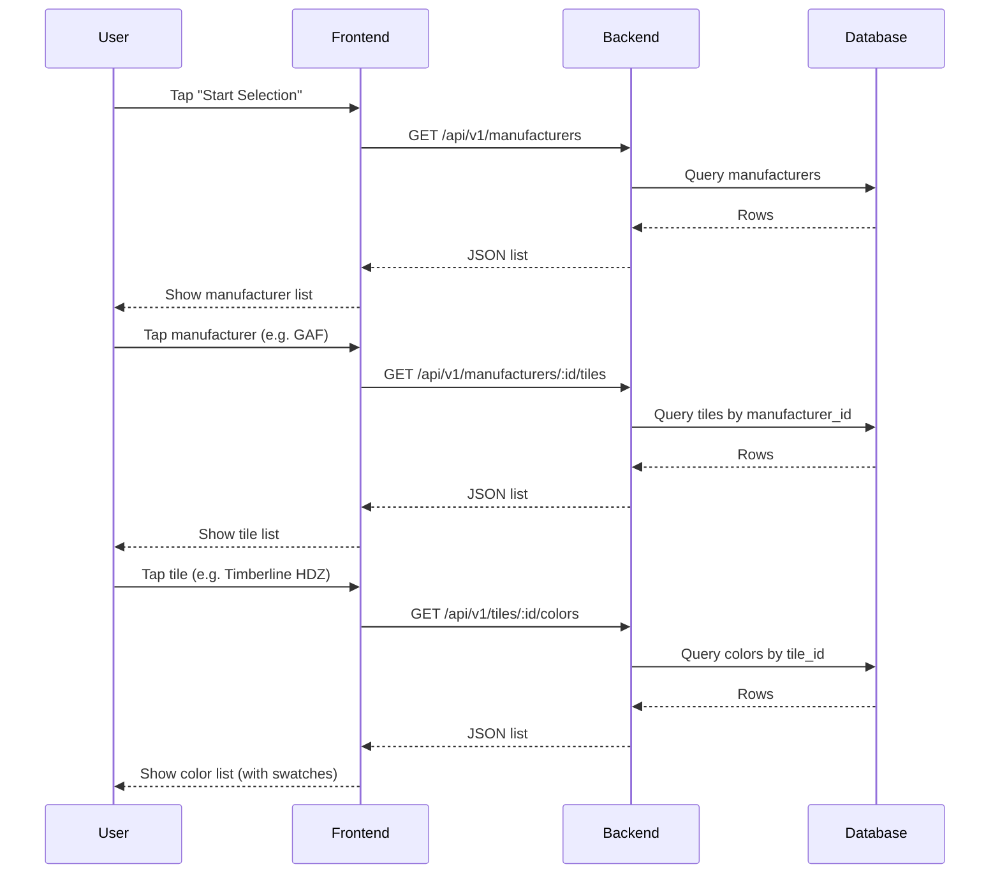

# RoofVision — Architecture Overview

## High-level system

```
┌─────────────────────────────────────────────────────────────────────────┐
│                           RoofVision System                              │
├─────────────────────────────────────────────────────────────────────────┤
│                                                                          │
│   ┌──────────────────┐         HTTP/REST          ┌──────────────────┐  │
│   │  React Native    │ ◄─────────────────────────► │  FastAPI          │  │
│   │  (Expo)          │      /api/v1/*              │  Backend          │  │
│   │  Frontend        │                             │  (Python)         │  │
│   │                  │                             │                   │  │
│   │  • Web (8083)    │                             │  • Port 8001      │  │
│   │  • iOS/Android   │                             │  • CORS enabled   │  │
│   └────────┬─────────┘                             └────────┬─────────┘  │
│            │                                                 │            │
│            │                                                 │            │
│            │                                                 ▼            │
│            │                                      ┌──────────────────┐   │
│            │                                      │  SQLite /        │   │
│            │                                      │  PostgreSQL      │   │
│            │                                      │  (SQLAlchemy)    │   │
│            │                                      └──────────────────┘   │
│            │                                                             │
│            │  (Phase 2: image upload → Phase 3: AI service)               │
│            └─────────────────────────────────────────────────────────────│
└─────────────────────────────────────────────────────────────────────────┘
```

---

## Component diagram (Mermaid)



---

## Data flow: selection waterfall



---

## Backend request path

1. **Request** hits `main.py` → CORS middleware → router at `/api/v1`.
2. **Router** dispatches to the correct module (health, manufacturers, tiles, colors).
3. **Route** uses `get_db()` dependency → gets a SQLAlchemy `Session`.
4. **Query** runs against models (Manufacturer, Tile, Color).
5. **Pydantic schemas** serialize the response; FastAPI returns JSON.

---

## Frontend request path

1. **User** taps a list item; screen calls `navigation.navigate(nextScreen, params)`.
2. **Next screen** mounts, `useEffect` runs, calls `api.getTilesByManufacturer(id)` (or similar).
3. **API client** (`src/api/client.js`) builds URL from `API_BASE_URL` + path, uses `fetch`.
4. **Response** is set in state; list renders. Errors show a message.

---

## Key decisions

| Decision | Rationale |
|----------|-----------|
| **Flat API (no nested embeds)** | Each step fetches the next list. Keeps payloads small and caching simple. |
| **SQLite default for dev** | No PostgreSQL setup required; switch via `DATABASE_URL` for production. |
| **Tables created on startup** | `Base.metadata.create_all()` in lifespan for quick dev; add Alembic for production migrations. |
| **Stack navigator** | Linear flow (Home → Mfr → Tile → Color) matches the waterfall; back button works naturally. |

---

## Phases

- **Phase 2 (done):** Camera / image picker → upload image + selection IDs to backend. Files stored in `backend/uploads/` (Option A); `POST /visualizations` and `GET /api/v1/uploads/{filename}`. Add Photo screen with compact preview and “Save to server.”
- **Phase 3:** Backend uses a simple AI agent with providers (mock or Gemini); returns visualization image.

Phase 3 will add new backend services and possibly a result screen on the frontend.
