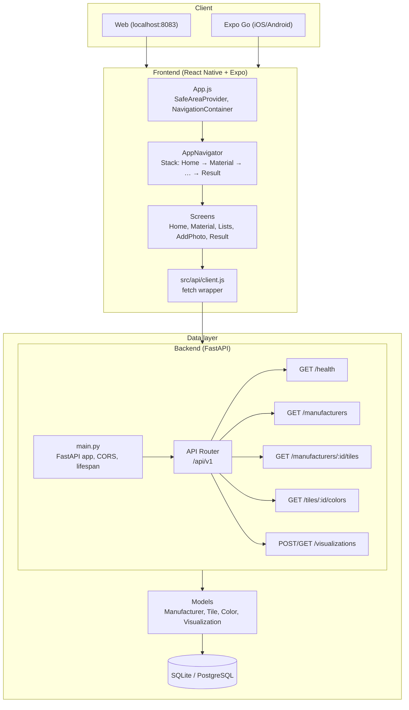
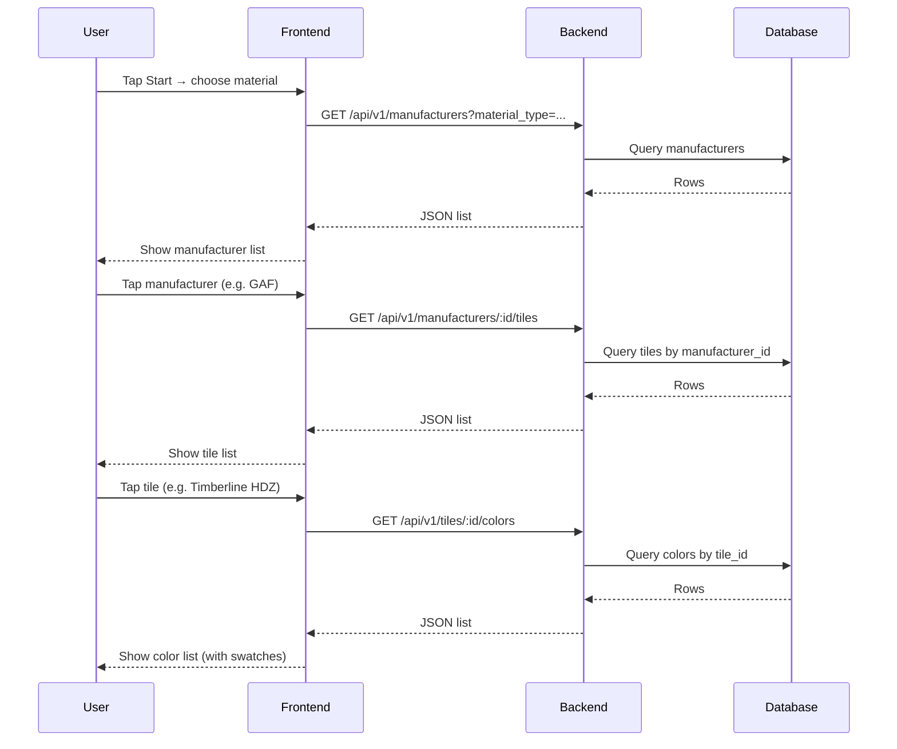

# RoofVision — Architecture Overview

## High-level system

```
┌─────────────────────────────────────────────────────────────────────────┐
│                           RoofVision System                              │
├─────────────────────────────────────────────────────────────────────────┤
│                                                                          │
│   ┌──────────────────┐         HTTP/REST          ┌──────────────────┐  │
│   │  React Native    │ ◄─────────────────────────► │  FastAPI          │  │
│   │  (Expo)          │      /api/v1/*              │  Backend          │  │
│   │  Frontend        │                             │  (Python)         │  │
│   │                  │                             │                   │  │
│   │  • Web (8083)    │                             │  • Port 8001      │  │
│   │  • iOS/Android   │                             │  • CORS enabled   │  │
│   └────────┬─────────┘                             └────────┬─────────┘  │
│            │                                                 │            │
│            │                                                 │            │
│            │                                                 ▼            │
│            │                                      ┌──────────────────┐   │
│            │                                      │  SQLite /        │   │
│            │                                      │  PostgreSQL      │   │
│            │                                      │  (SQLAlchemy)    │   │
│            │                                      └──────────────────┘   │
│            │                                                             │
│            │  (Phase 2: upload → Phase 3: AI agent + Gemini image API)      │
│            └─────────────────────────────────────────────────────────────│
└─────────────────────────────────────────────────────────────────────────┘
```

---

## Component diagram (Mermaid)


```mermaid
flowchart TB
    subgraph Client["Client"]
        Web["Web (localhost:8083)"]
        ExpoGo["Expo Go (iOS/Android)"]
    end

    subgraph Frontend["Frontend (React Native + Expo)"]
        App["App.js\nSafeAreaProvider, NavigationContainer"]
        Nav["AppNavigator\nStack: Home → Material → … → Result"]
        Screens["Screens\nHome, Material, Lists, AddPhoto, Result"]
        APIClient["src/api/client.js\nfetch wrapper"]
        App --> Nav --> Screens
        Screens --> APIClient
    end

    subgraph Backend["Backend (FastAPI)"]
        Main["main.py\nFastAPI app, CORS, lifespan"]
        Router["API Router\n/api/v1"]
        Health["GET /health"]
        Manufacturers["GET /manufacturers"]
        Tiles["GET /manufacturers/:id/tiles"]
        Colors["GET /tiles/:id/colors"]
        Viz["POST/GET /visualizations"]
        Main --> Router
        Router --> Health
        Router --> Manufacturers
        Router --> Tiles
        Router --> Colors
        Router --> Viz
    end

    subgraph Data["Data layer"]
        DB[(SQLite / PostgreSQL)]
        Models["Models\nManufacturer, Tile, Color, Visualization"]
        Backend --> Models
        Models --> DB
    end

    Web --> Frontend
    ExpoGo --> Frontend
    APIClient --> Backend
```

---

## Data flow: selection waterfall


```mermaid
sequenceDiagram
    participant U as User
    participant F as Frontend
    participant B as Backend
    participant DB as Database

    U->>F: Tap Start → choose material
    F->>B: GET /api/v1/manufacturers?material_type=...
    B->>DB: Query manufacturers
    DB-->>B: Rows
    B-->>F: JSON list
    F-->>U: Show manufacturer list

    U->>F: Tap manufacturer (e.g. GAF)
    F->>B: GET /api/v1/manufacturers/:id/tiles
    B->>DB: Query tiles by manufacturer_id
    DB-->>B: Rows
    B-->>F: JSON list
    F-->>U: Show tile list

    U->>F: Tap tile (e.g. Timberline HDZ)
    F->>B: GET /api/v1/tiles/:id/colors
    B->>DB: Query colors by tile_id
    DB-->>B: Rows
    B-->>F: JSON list
    F-->>U: Show color list (with swatches)
```

---

## Backend request path

1. **Request** hits `main.py` → CORS middleware → router at `/api/v1`.
2. **Router** dispatches to the correct module (health, manufacturers, tiles, colors, visualizations).
3. **Route** uses `get_db()` dependency → gets a SQLAlchemy `Session`.
4. **Query** runs against models (Manufacturer, Tile, Color).
5. **Pydantic schemas** serialize the response; FastAPI returns JSON.

---

## Frontend request path

1. **Cold start:** `AuthProvider` hydrates user + onboarding flags from AsyncStorage; `RootNavigator` shows auth, onboarding, or the main stack.
2. **User** taps a list item; screen calls `navigation.navigate(nextScreen, params)`.
3. **Next screen** mounts, `useEffect` runs, calls `api.getTilesByManufacturer(id)` (or similar).
4. **API client** (`src/api/client.js`) builds URL from `API_BASE_URL` + path, uses `fetch`.
5. **Response** is set in state; list renders. Errors show a message.

---

## Key decisions

| Decision | Rationale |
|----------|-----------|
| **Flat API (no nested embeds)** | Each step fetches the next list. Keeps payloads small and caching simple. |
| **SQLite default for dev** | No PostgreSQL setup required; switch via `DATABASE_URL` for production. |
| **Tables created on startup** | `Base.metadata.create_all()` in lifespan for quick dev; add Alembic for production migrations. |
| **Stack navigator** | Linear flow (Home → Material → … → Result) matches the waterfall; back button works naturally. |
| **Client auth (v1)** | Demo Google + guest in `AuthContext`; `EXPO_PUBLIC_HIDE_DEMO_GOOGLE` hides demo for store-like builds. |
| **CORS** | `CORS_ORIGINS` env (comma-separated). Empty = `*` for local dev; set explicit origins in production. |
| **Upload rate limit** | SlowAPI on `POST /visualizations` (`RATE_LIMIT_UPLOAD`, default `30/minute`). |
| **Health** | `GET /health` liveness; `GET /health/ready` checks DB for orchestrators. |

---

## Phases

- **Phase 2 (done):** Camera / image picker → upload image + selection IDs to backend. Files stored in `backend/uploads/` (Option A); `POST /visualizations` and `GET /api/v1/uploads/{filename}`. Add Photo screen with preview, input-quality hints, and **Generate**.
- **Phase 3 (done for MVP):** Backend uses `AIAgent` + `ImageGenProvider` implementations (`mock`, `GeminiProvider`). Prompt is built from catalog + optional `hex_code` and product slug hints. On provider failure, job completes with mock preview and a user-facing `error_message` when applicable. See [IMAGE-GEN-API.md](./IMAGE-GEN-API.md).

## AI layer (current)

| Path | Role |
|------|------|
| `app/services/generator.py` | Builds prompt, runs agent, writes `result_*` to `uploads/`, updates `Visualization` |
| `app/services/ai_agent.py` | Thin wrapper over configured provider |
| `app/services/image_providers/` | `MockProvider`, `GeminiProvider`, `factory.get_image_provider()` |

## Compliance & copy (product)

See [COMPLIANCE-AND-COPY.md](./COMPLIANCE-AND-COPY.md) for preview language, disclaimers, and scope boundaries aligned with independent visualization (not manufacturer-official output).
